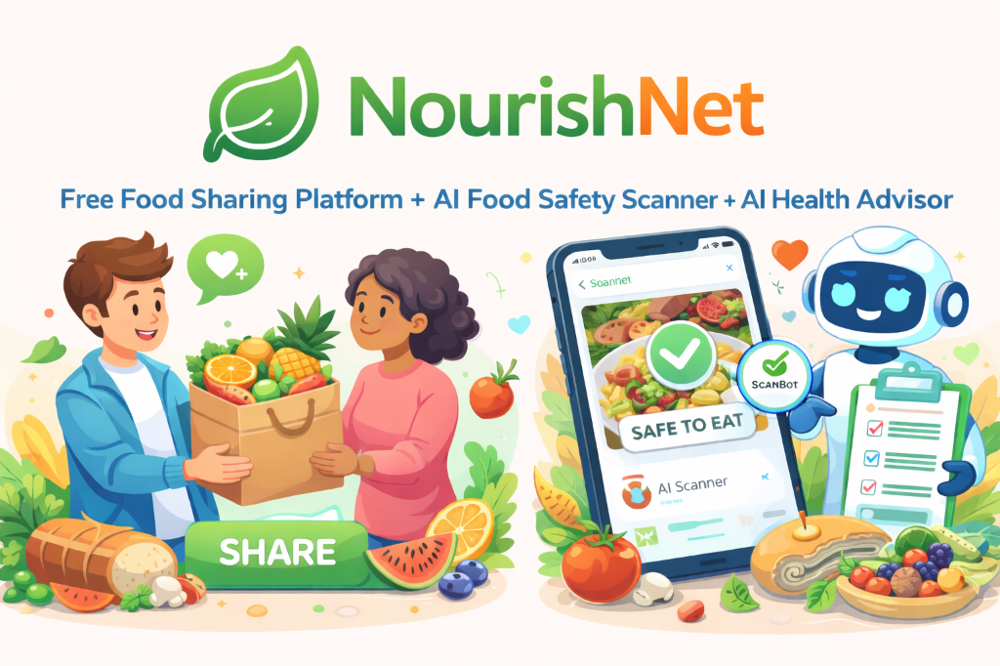

<p align="center">
  
</p>

<h1 align="center">🌿 NourishNet</h1>

<p align="center">
  <b>AI-Powered Community Food Sharing Platform — Reducing food waste, one meal at a time.</b>
</p>

<p align="center">
  <a href="#-features"></a>
  <a href="#-tech-stack"></a>
  <a href="#-ai-powered"></a>
  <a href="#-progressive-web-app-pwa"></a>
</p>

<p align="center">
  <a href="#-quick-start">Quick Start</a> •
  <a href="#-features">Features</a> •
  <a href="#-ai-powered">AI Modules</a> •
  <a href="#-tech-stack">Tech Stack</a> •
  <a href="#-architecture">Architecture</a> •
  <a href="#-deployment">Deployment</a> •
  <a href="#-contributing">Contributing</a>
</p>

---

## 📋 Table of Contents

- [About](#-about)
- [The Problem](#-the-problem)
- [Features](#-features)
- [AI Powered](#-ai-powered)
- [Tech Stack](#-tech-stack)
- [Architecture](#-architecture)
- [Quick Start](#-quick-start)
- [Environment Variables](#-environment-variables)
- [Project Structure](#-project-structure)
- [Deployment](#-deployment)
- [Multilingual Support](#-multilingual-support)
- [Screenshots](#-screenshots)
- [Progressive Web App (PWA)](#-progressive-web-app-pwa)
- [Roadmap](#-roadmap)
- [Contributing](#-contributing)
- [Author](#-author)

---

## 🌍 About

**NourishNet** is a full-stack, AI-enhanced community food sharing platform designed to bridge the gap between food surplus and food scarcity. Users can post surplus food, discover free food near them, and connect with their community — all while ensuring food safety through built-in AI-powered scanners.

> **Mission:** To minimize food waste, fight hunger, and build stronger communities through technology.

---

## 🚨 The Problem

| Stat | Value |
|------|-------|
| 🌎 Global food wasted yearly | **1.05 Billion Tonnes** |
| 📊 Global food production wasted | **~19%** |
| 🇮🇳 Food wasted annually in India | **74 Million Tonnes** |
| 💰 Annual economic loss in India | **₹92,000 Crores** |
| 🍽️ Per capita waste in India/year | **50–55 kg** |

NourishNet directly addresses this crisis by creating a hyperlocal food-sharing ecosystem powered by AI safety verification.

---

## ✨ Features

### 🍲 Core Food Sharing
- **Post Surplus Food** — Upload food with images, descriptions, category, cuisine type, tags, expiry dates, and precise geolocation via interactive maps.
- **Discover Food Near You** — Browse available food in your community with Grid/List/Map views, real-time search, and advanced filters (category, cuisine, tags, distance).
- **Request & Connect** — Request food from providers, track request status (pending → accepted → collected), and communicate seamlessly.
- **Smart Food Lifecycle** — Automatic expiry detection and status management for food posts.

### 👤 User Experience
- **Secure Authentication** — Email/password and GitHub OAuth via Supabase Auth with protected routes.
- **Rich User Profiles** — Avatar upload, bio, dietary preferences, location, and profile completion tracking.
- **Provider Ratings & Reviews** — Rate and review food providers with a 5-star system and feedback comments.
- **Real-Time Updates** — Live Supabase subscriptions for instant food post and request status changes.

### 🎨 Premium Design
- **Glass Morphism UI** — Stunning frosted-glass cards with premium shadows and micro-animations.
- **Dark/Light Theme** — Seamless theme switching with nature-inspired color palettes.
- **Fully Responsive** — Pixel-perfect layouts from mobile (320px) to ultrawide (2560px+) with a custom floating bottom navigation capsule.
- **Framer Motion Animations** — Smooth GPU-accelerated transitions, fade-ups, and scale-ins throughout the app.
- **Installable PWA** — Add to home screen on any device. Works offline with smart caching strategies.

---

## 🤖 AI Powered

NourishNet integrates **two independent AI modules** powered by the **Pollinations Vision API**:

### 🔬 AI Food Safety Scanner
> Integrated into the **Add Food** page

- Analyzes uploaded food images for **visible spoilage indicators** (mold, discoloration, sliminess, damaged packaging).
- Detects **expiry/best-before dates** from images if visible.
- Returns a structured **risk assessment** (LOW / MEDIUM / HIGH) with detailed reasoning.
- Provides a **user-facing safety recommendation**.
- Includes image compression, retry logic, and timeout handling for reliability.

### 🏥 AI Health Advisor
> Accessible from the **Dashboard & Health Advisor** page

- Identifies food items from uploaded images.
- Estimates **calorie count** per typical serving.
- Assesses health risks across three dimensions:
  - 🩸 **Diabetic Risk** — Sugar/carbohydrate impact analysis
  - 🫀 **Cholesterol Impact** — Saturated fat assessment
  - ⚖️ **Weight Gain Potential** — Caloric density and regular consumption impact
- Provides **personalized AI health suggestions** and a nutrient summary.

---

## 🛠 Tech Stack

### Frontend
| Technology | Purpose |
|---|---|
| **React 18** | UI Library |
| **TypeScript** | Type Safety |
| **Vite 5** | Build Tool & Dev Server |
| **Tailwind CSS 3** | Utility-first Styling |
| **Shadcn/UI** | Radix-based Component Library |
| **Framer Motion** | Animations & Transitions |
| **React Router v6** | Client-side Routing |
| **React Hook Form + Zod** | Form Management & Validation |
| **TanStack Query** | Server State Management |
| **Recharts** | Data Visualization |
| **Lucide React** | Icon Library |
| **Sonner** | Toast Notifications |

### Backend & Infrastructure
| Technology | Purpose |
|---|---|
| **Supabase** | Auth, PostgreSQL Database, Real-time Subscriptions, Storage |
| **Pollinations AI** | Vision API for Food Safety & Health Analysis |
| **Vercel** | Hosting & Deployment |
| **Leaflet** | Interactive Maps |
| **Workbox (vite-plugin-pwa)** | Service Worker & Offline Caching |

---

## 🏗 Architecture

```
┌──────────────────────────────────────────────────────┐
│                    FRONTEND (React + Vite)            │
│  ┌────────────┐ ┌──────────┐ ┌─────────────────────┐ │
│  │   Pages    │ │Components│ │     Providers       │ │
│  │ Dashboard  │ │ Layout   │ │  AuthProvider       │ │
│  │ PostFood   │ │ Modals   │ │  LanguageProvider   │ │
│  │ Requests   │ │ FoodViews│ │  ThemeProvider      │ │
│  │ Scanner    │ │ UI (50+) │ │  QueryProvider      │ │
│  └─────┬──────┘ └────┬─────┘ └──────────┬──────────┘ │
│        │             │                   │            │
│  ┌─────┴─────────────┴───────────────────┴──────────┐ │
│  │              Hooks & Utilities                    │ │
│  │  useAuth · useFoodPostRequests · useTranslation  │ │
│  │  useStats · foodScannerApi · healthAdvisorApi    │ │
│  └───────────────────┬──────────────────────────────┘ │
└──────────────────────┼───────────────────────────────┘
                       │
          ┌────────────┴────────────┐
          ▼                         ▼
┌──────────────────┐     ┌──────────────────┐
│    Supabase      │     │  Pollinations AI │
│  ┌────────────┐  │     │  ┌────────────┐  │
│  │ PostgreSQL │  │     │  │ Vision API │  │
│  │   Auth     │  │     │  │ Food Safety│  │
│  │  Storage   │  │     │  │ Health     │  │
│  │ Realtime   │  │     │  │ Advisor    │  │
│  └────────────┘  │     │  └────────────┘  │
└──────────────────┘     └──────────────────┘
```

---

## 🚀 Quick Start

### Prerequisites
- **Node.js** ≥ 18.x
- **npm** ≥ 9.x
- A **Supabase** project ([create one free](https://supabase.com))

### Installation

```bash
# 1. Clone the repository
git clone https://github.com/SanjayD11/NourishNet.git
cd NourishNet

# 2. Install dependencies
npm install

# 3. Create environment file
cp .env.example .env
# Fill in your Supabase credentials (see below)

# 4. Start development server
npm run dev
```

The app will be running at `http://localhost:8080` 🎉

---

## 🔐 Environment Variables

Create a `.env` file in the project root:

```env
VITE_SUPABASE_URL=your_supabase_project_url
VITE_SUPABASE_ANON_KEY=your_supabase_anon_key
```

> **Note:** The AI Scanner modules (Pollinations API) are pre-configured and do not require additional environment variables.

---

## 📁 Project Structure

```
NourishNet/
├── public/                    # Static assets & banner
├── src/
│   ├── components/
│   │   ├── ui/                # 50+ Shadcn/UI components
│   │   ├── FoodViews/         # Grid, List, Map views
│   │   ├── Layout.tsx         # App shell with responsive nav
│   │   ├── FoodDetailsModal   # Food detail popup
│   │   ├── ProviderProfileModal
│   │   ├── RatingModal        # 5-star rating system
│   │   ├── SmartImageCapture  # Camera + gallery upload
│   │   ├── LanguageSelector   # Multilingual dropdown
│   │   └── ...
│   ├── hooks/
│   │   ├── useAuth.tsx        # Authentication state
│   │   ├── useFoodPostRequests# Request lifecycle management
│   │   ├── useTranslation.ts  # Translation engine
│   │   ├── useStats.tsx       # Live platform statistics
│   │   └── ...
│   ├── pages/
│   │   ├── Index.tsx          # Landing page
│   │   ├── Dashboard.tsx      # Food discovery feed
│   │   ├── PostFood.tsx       # Create food listing
│   │   ├── Requests.tsx       # Manage food requests
│   │   ├── FoodScanner.tsx    # AI Health Advisor
│   │   ├── ManagePosts.tsx    # Edit/delete own posts
│   │   ├── Profile.tsx        # User settings
│   │   ├── WhyNourishNet.tsx  # About page
│   │   └── Auth.tsx           # Login/Register
│   ├── providers/
│   │   └── LanguageProvider   # i18n context with 5 languages
│   ├── utils/
│   │   ├── foodScannerApi.ts  # AI Food Safety Scanner
│   │   ├── healthAdvisorApi.ts# AI Health Advisor
│   │   └── validation.ts     # Zod schemas
│   ├── integrations/          # Supabase client config
│   └── index.css              # Design system & theme tokens
├── supabase/
│   └── migrations/            # Database schema & RLS policies
├── vercel.json                # SPA routing config
├── tailwind.config.ts         # Design tokens & animations
├── vite.config.ts             # Vite configuration
└── package.json
```

---

## 🚢 Deployment

### Deploy to Vercel (Recommended)

1. Push your code to GitHub.
2. Import the repository on [Vercel](https://vercel.com).
3. Vercel auto-detects **Vite** — no config changes needed.
4. Add environment variables in **Settings → Environment Variables**:
   - `VITE_SUPABASE_URL`
   - `VITE_SUPABASE_ANON_KEY`
5. Click **Deploy** — done! 🚀

> The included `vercel.json` handles SPA routing automatically so page refreshes work correctly on all routes.

### Build for Production

```bash
npm run build    # Outputs to dist/
npm run preview  # Preview production build locally
```

---

## 🌐 Multilingual Support

NourishNet features a **native translation system** (no Google Translate dependency) supporting:

| Language | Code | Coverage |
|----------|------|----------|
| 🇬🇧 English | `en` | Full |
| 🇮🇳 Tamil | `ta` | Full |
| 🇮🇳 Hindi | `hi` | Full |
| 🇮🇳 Telugu | `te` | Full |
| 🇮🇳 Bengali | `bn` | Full |

Translations are **instant** — no page reloads, no layout shifts. Every string across all pages (Dashboard, Requests, Add Food, Health Advisor, Manage Posts, Profile) is translated natively.

---

## 📲 Progressive Web App (PWA)

NourishNet is a fully **installable PWA** — it works like a native app on any device!

### ✨ PWA Features
- **Install to Home Screen** — Tap "Add to Home Screen" in your browser to install NourishNet as a standalone app.
- **Offline Support** — Smart caching strategies ensure core pages load even without internet.
- **Auto-Update** — The service worker silently updates when new versions are deployed.
- **Fullscreen Standalone Mode** — Launches without browser chrome, just like a native app.

### ⚡ Caching Strategy
| Resource | Strategy | Cache Duration |
|---|---|---|
| Static Assets (JS, CSS, HTML) | **Precache** | Updated on deploy |
| Supabase API Responses | **Network First** | 5 minutes fallback |
| Supabase Storage Images | **Cache First** | 7 days |
| Google Fonts | **Cache First** | 1 year |

### 📱 How to Install
1. Open NourishNet in **Chrome/Safari** on your phone.
2. Tap the browser menu (⋮) → **"Add to Home Screen"** or **"Install App"**.
3. NourishNet appears on your home screen with the 🌿 leaf icon!

---

## 📸 Screenshots

<details>
<summary><b>🖥 Desktop Views</b> (click to expand)</summary>

| Landing Page | Dashboard |
|---|---|
| Hero section with animated stats | Food discovery with Grid/List views |

| AI Health Advisor | Post Food |
|---|---|
| Upload food → get health risk analysis | Smart image capture with AI safety scan |

</details>

<details>
<summary><b>📱 Mobile Views</b> (click to expand)</summary>

| Mobile Dashboard | Mobile Navigation |
|---|---|
| Responsive cards | Floating capsule bottom nav |

</details>

---

## 🗺 Roadmap

- [x] Core food sharing (post, discover, request)
- [x] AI Food Safety Scanner
- [x] AI Health Advisor
- [x] Real-time notifications
- [x] Dark/Light theme
- [x] Multilingual support (5 languages)
- [x] Provider ratings & reviews
- [x] Interactive map views
- [x] Avatar upload & profile customization
- [x] Progressive Web App (PWA) with offline caching
- [ ] Push notifications
- [ ] In-app chat between providers and requesters
- [ ] Food donation analytics dashboard
- [ ] Community leaderboard & badges
- [ ] Integration with local food banks & NGOs

---

## 🤝 Contributing

Contributions are welcome! Here's how to get started:

```bash
# 1. Fork the repository
# 2. Create a feature branch
git checkout -b feature/amazing-feature

# 3. Make your changes and commit
git commit -m "feat: add amazing feature"

# 4. Push to your fork
git push origin feature/amazing-feature

# 5. Open a Pull Request
```

### Guidelines
- Follow the existing code style (TypeScript + React conventions).
- Use `shadcn/ui` components where possible.
- Write meaningful commit messages using [Conventional Commits](https://www.conventionalcommits.org/).
- Ensure your changes work on both mobile and desktop.

---

## 👨‍💻 Author

<p align="center">
  <b>Sanjay Dharmarajou</b><br>
  <a href="https://github.com/SanjayD11">GitHub</a>
</p>

<p align="center">
  <i>© 2025 NourishNet. Reducing food waste, one meal at a time.</i><br>
  <i>A product by <b>Sanjay Dharmarajou</b></i>
</p>

---

<p align="center">
  Made with 💚 for a hunger-free world
</p>
